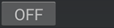

!!!xdrip ""  
    &ensp;&ensp;Smart Watch Features  
    &emsp;  BlueJay Watch

You can buy your BlueJay Watch [here: ](https://bluejay.website/) 

The [BlueJay U3](https://bluejay.website/shop) is the current watch and is available now. It runs the full xDrip package on Android and connects directly to your G6, G7 and Dexcom ONE/ONE+ sensors.

The earlier X2, GTS, U1 and U2 models are **no longer sold**. Their setup instructions are kept below for existing owners.  
Legacy references: [GTS](https://bluejay.website/shop/product/bluejay-gts-26) (standalone or with xDrip), [U1](https://bluejay.website/shop/product/bluejay-u1-27) and [U2](https://bluejay.website/shop/product/bluejay-u2-28).

!!!info "Sharing BG"  
    BlueJay X2/GTS are only Bluetooth and cannot share BG data without being connected to your phone xDrip.  
    The U1/U2/U3 run full xDrip and can also relay readings to a phone or other followers over Bluetooth (xDrip Link) or the internet (xDrip Sync).

BlueJay watches are powerful companions for your G6, G7 and 1/1+ sensors. They connect directly to the transmitter but you need to be aware of the limitations.

##### G6/G7 and 1/1+

These transmitters have two Bluetooth slots: phone and non-phone.  
You can configure your slots as per the table below. Only two devices can be connected simultaneously to the transmitter, each one using a unique slot.  
By default BlueJay uses the non-phone slot. See [here for GTS](#run-collector) how to change this setting.

U1, U2 and U3 need to be connected first to the sensor. Once connected, you can also enable the second connection and the watch will automatically select the available free slot.

| Vendor app          | Receiver                | Connected pump                            | BlueJay Watch                             |
| ------------------- | ----------------------- | ----------------------------------------- | ----------------------------------------- |
| Cannot be used      | Cannot be used          | Cannot be used                            | Non-phone slot **xDrip uses phone slot** |
| **Uses phone slot** | Cannot be used          | Cannot be used                            | Non-phone slot                            |
| Cannot be used      | **Uses non-phone slot** | Cannot be used                            | Phone slot                                |
| Cannot be used      | Cannot be used          | t:slim, Omnipod 5 **use non-phone slots** | Phone slot                                |
| Cannot be used      | Cannot be used          | CamAPS, DBLG1 **use phone slot**          | Non-phone slot                            |

*Note: xDrip uses the phone slot by default, non-phone slot requires engineering mode*

## BlueJay U3

The U3 runs full Android and the xDrip core on the watch itself. You set it up on the watch and can optionally relay readings to your phone.

### U3 controls

The U3 has two physical buttons: a **Left** button (orange) and a **Right** button. On the U1/U2 the right control was a winder; on the U3 that position is the camera.

- Press either button to wake the screen.  
- The **Right** button turns the screen off.  
- The **Left** button goes back.  
- Long-press the power button for the Shutdown / Reboot / SOS menu, then swipe the option you want to the right.

### Get readings on the U3

Set the sensor identifier on the watch in xDrip, exactly as you would on a phone: go to Settings &ensp;›&ensp; Hardware Data Source &ensp;›&ensp; DexcomG5/G6/G7.

- **G6** — enter the **Transmitter ID (TXID)**.  
- **G7 / Dexcom ONE+** — enter the **4-digit pairing code**.

With a new sensor, set the ID/code on the watch first and let it get readings before setting it on any phone app. With a sensor that is already running with a phone app connected, temporarily disable the phone app (turn it off, disable Bluetooth, or move out of range), connect the watch, then re-enable the phone app once the watch has readings.

### Transmitter slot

By default the U3 uses the **non-phone slot**. Refer to the [slot table above](#g6g7-and-11) to choose the right slot. To move the watch to the **phone slot**, scan the corresponding QR code in:

!!!xdrip ""  
    &ensp;Auto Configure

Avoid repeatedly swapping the device on a slot: the sensor can jam. The slot is a fixed configuration, not a hot-swap.

!!!warning "G7 phone-channel update"  
    If your watch stops getting **G7** readings, apply the watch software update: on the watch open **Android Settings › Software Upgrade**, connected to WiFi and on charge (battery > 25%), check for updates and install.  
    Afterwards you can switch the watch to the phone channel by scanning the QR code shown in xDrip **Settings › Auto-configure**, then reboot the watch.  
    With this method the **watch and a phone app cannot both** get readings directly from the sensor: disable the phone app collector if the watch is the collector.

### Snooze an xDrip alarm

Long-press the **orange Left button** until the watch vibrates.

### Relay readings to your phone or followers

When the watch is the collector you can still feed your phone and other devices:

- **xDrip Link** — watch ↔ phone over Bluetooth when in range. On the watch, open the **xDrip Link** app, enable it and scan its QR code in phone xDrip **Settings › Auto Configure**. BlueJay settings entered on the phone (including the TXID/pairing code) are copied to the watch. If the phone should not collect directly, set [Run Phone Collector](#run-phone-collector) **Off** on the phone.  
- **xDrip Sync** — relays readings over the internet (WiFi/4G) from a master to one or more followers, including watch-to-watch and phone-to-watch.

!!!info "Non-xDrip watch features"  
    Inserting a SIM, WiFi, the camera, watch faces, straps, screen covers, Google account, phone calls, GPS, SOS calling, music and the on-watch software upgrade are documented by the vendor. See the BlueJay [Top Tips / FAQ](https://bluejay.website/faq).

## Legacy models: X2 / GTS

The following steps apply to the older X2 and GTS watches, which are no longer sold.

### Pair your watch to xDrip (X2 and GTS)

1 - Make sure the watch is charged before starting.

2 - Enable BlueJay and disable watch collector.  

!!!xdripitem "BlueJay Watch " 

!!!xdripitem "Run Collector "  

3 - If you have a BlueJay GTS continue to 6.  
If you have a BlueJay X2 it should show a QR code on the screen.  
  
If you see it continue to 7.

4 - Launch BlueJay Panel and Scan.  
!!!xdripitem "Launch BlueJay Panel"   
  
When the watch is detected you should see its Mac address. Select it.  
   
If xDrip doesn't find the watch, try to restart your phone and retry. If you still can't find it: you can enter the watch Mac address manually here   
!!!xdripitem "BlueJay Advanced Settings"  
    &ensp;BlueJay Mac

The QR code should now appear on the watch, if you see it: continue to 7.

5 - If the QR code didn't show-up on your watch, select QR and retry.  
  
If you still can't see the QR code try REBOOT then [contact](https://bluejay.website/contactus) the vendor for assistance or seek help [here](https://gitter.im/jamorham/BlueJay).

6 - On the GTS follow this menu sequence to display the QR code:  
Settings Menu -> Admin Menu -> Show QR Code  
 

7 - In xDrip scan the watch QR code  
!!!xdrip ""  
    &ensp;Auto Configure    
You need to authorize xDrip to access the phone camera.  
Scan the QR code displayed on the watch.  

Setup the watch as a follower and you should see your BG within minutes.

!!!xdripitem "BlueJay Watch " 

!!!xdripitem "Run Collector "  

!!!xdripitem "Send Readings " 

Check [System Status](../../troubleshoot/systemstatus/) to confirm the watch paired correctly. Swipe to the advanced status tab BlueJay.  

If the xDrip core is not installed you should install it now.

### Install the xDrip Core 

!!!warning "Put the watch in charge whilst installing the core"

In xDrip System Status, BlueJay advanced status, tap the red line xDrip Core: Not Installed.

Select OK to update the watch.

Check System Status afterwards, you should see the core installed.

### Run collector

Run collector means you will be using the watch without having necessarily your phone with you.

You must setup the watch using xDrip if you use an X2 model.  
For GTS you can do it directly through the watch [menu](https://bluejay.website/gts-menu-top), without using xDrip.

In order to use the watch with xDrip you must have a transmitter directly connected to xDrip with BG data currently displaying in xDrip.

Define which slot will connect to the transmitter. Refer to the table [above](#g6g7-and-11) to setup your slots.

!!!xdripitem "BlueJay Advanced Settings" 

##### Run Phone Collector

!!!xdripitem "Run Phone Collector "  
    &ensp;Also run the standard collector on this phone. Only turn this off if you don't want this phone itself to be connecting to the transmitter.

Enables/disable the connection of xDrip to the transmitter (using the phone slot).

##### BlueJay uses Phone Slot

!!!xdripitem "BlueJay uses Phone Slot "  
    &ensp;This allows the BlueJay to occupy the phone slot on the transmitter. Select this if you want another non-phone device to be able to connect to the transmitter and you are not using a phone to connect to the transmitter.

By default BlueJay uses the non-phone slot. You can let it use the phone slot with this option but you should then disable Run Phone Collector above.

Once slots setup you can enable the watch as a standalone collector device.

!!!xdripitem "BlueJay Watch " 

!!!xdripitem "Run Collector "  

You will then see your phone xDrip is not connected to the transmitter anymore: BlueJay is.  
When your watch is within Bluetooth range, your phone should receive BG from BlueJay.

## BlueJay GTS

GTS doesn't need xDrip to be setup but the steps above should also apply if you want to so so.

See the video [here](https://www.youtube.com/watch?v=JM5cw-xVAZk) for a guided tour.

See here [how](https://www.youtube.com/watch?v=6YpjuZe2c_Q) to connect to the transmitter.

## BlueJay U1/U2 (legacy)

The U1 and U2 are no longer sold but run the same full-xDrip package as the U3, so the [U3 setup](#bluejay-u3) above applies. See the vendor [Top Tips / FAQ](https://bluejay.website/faq) for U-series watch tips.

 

[*Last modified 7/18/2026*](https://github.com/NightscoutFoundation/xDrip/releases/tag/2024.11.26)